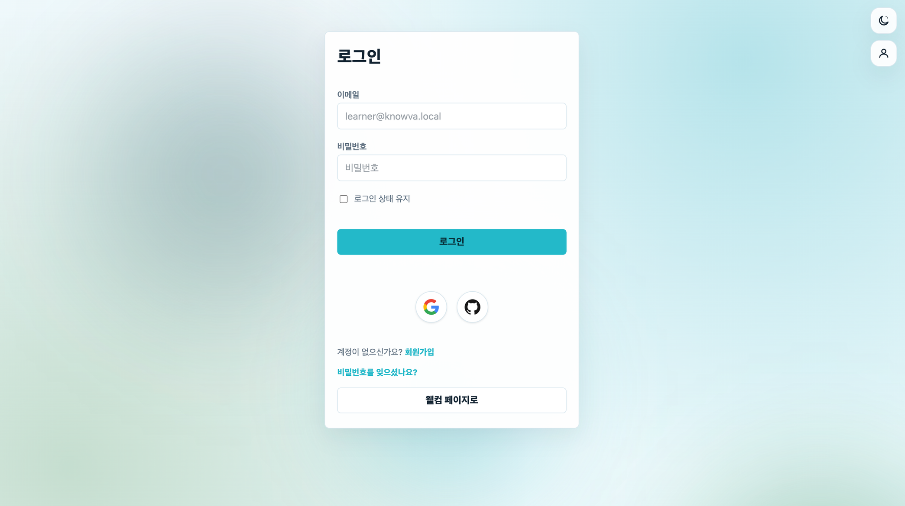

# Knowva

코딩 입문자를 위한 웹 학습 플랫폼입니다.

[포트폴리오 홈](../../README.md) · [팀 저장소](https://github.com/hyunkyumlee/Acorn-E-Learning)

## 프로젝트 개요

**기간:** 2026.06.17–2026.07.27  
**구성:** 7인 팀 프로젝트

코딩 입문자가 이론 학습, 문제풀이, 오답 복습과 커뮤니티 기록을 이어갈 수 있는 웹 학습 플랫폼입니다. 저는 웰컴 튜토리얼부터 회원가입·로그인, 비밀번호 재설정까지 사용자의 서비스 진입 흐름을 구현하고, 인증·보안·세션 관리를 담당했습니다.

이메일 로그인, Google·GitHub 로그인과 회원가입·비밀번호 찾기 진입 화면입니다.

## 담당 범위

인증·세션 담당으로 회원가입, 일반 로그인, Google·GitHub OAuth, 로그인 상태 재검증, 자동 로그인, 이메일 기반 비밀번호 재설정과 웰컴 튜토리얼을 구현했습니다.

아래 내용은 팀 서비스 중 제가 담당한 인증·세션과 온보딩 기능입니다.

## 사용 기술

Java 17 · Spring Boot 4.0.6 · Spring MVC · MyBatis · MySQL · Thymeleaf  
HttpSession · BCrypt · OAuth · Java Mail · JUnit · Git/GitHub

## 소셜 로그인과 추가 회원가입 흐름 분리

Google·GitHub 인증을 마친 뒤 추가 정보 입력 중에 이탈하면 불완전한 계정이 남을 수 있어, 소셜 인증과 회원 생성을 분리했습니다. 처음 로그인한 사용자의 인증 정보는 세션에 임시 보관하고, 닉네임과 관심 과목 입력을 마친 뒤 계정과 관련 데이터를 하나의 트랜잭션으로 저장했습니다. 이미 연동된 계정은 바로 로그인하도록 분기하고, 인증 요청 때 저장한 state를 콜백에서 대조해 요청의 일치 여부를 확인했습니다.

## 자동 로그인과 비밀번호 변경의 연결

자동 로그인 쿠키에는 사용자 식별자, 비밀번호 변경 시각을 바탕으로 한 버전, HMAC 서명을 사용했습니다. 복원 시 서명과 계정 상태, 버전 일치를 확인해 비밀번호 변경 전에 발급된 자동 로그인 쿠키로는 세션이 복원되지 않도록 했습니다.

## 비밀번호 재설정 링크의 재사용 방지

재설정 토큰은 충분한 길이의 난수로 발급하고 DB에는 원문 대신 SHA 256 해시를 저장했습니다. 만료 시각과 사용 여부를 확인하고, 미사용 토큰만 사용 처리할 수 있는 조건부 갱신 결과를 검사했습니다. 토큰 사용 처리와 비밀번호 변경을 같은 트랜잭션으로 묶었습니다.

## 웰컴 튜토리얼

단계별 메시지와 캐릭터 위치 등을 화면 모델로 전달하고, 방문자의 로그인 상태와 역할에 맞게 진입 화면을 연결했습니다.

## 구현 결과

회원가입부터 로그인 유지, 계정 상태 변경 반영, 비밀번호 복구까지 인증 흐름을 연결했습니다. 계정 상태와 토큰 상태를 서버에서 다시 확인하는 지점을 구분하고, 관련 서비스와 인터셉터 테스트를 작성했습니다.
